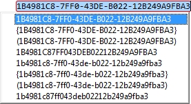
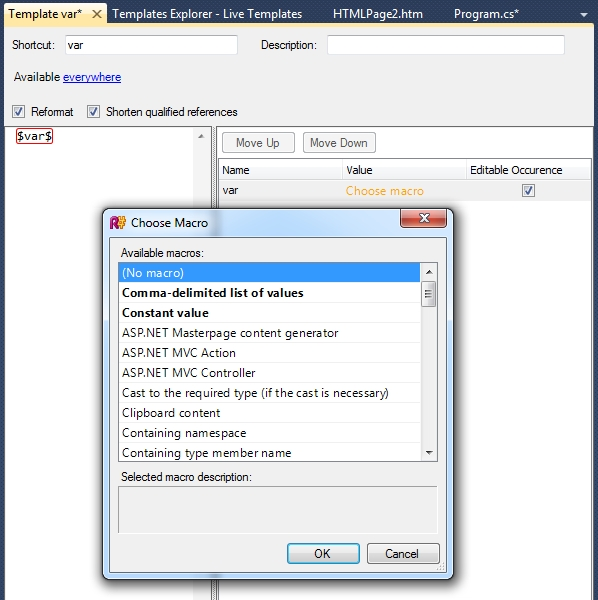

---
---

# Live Templates

ReSharper's Live Templates provide dynamic text expansion. While in the text editor, if you type a Live Template shortcut, or select it from a Code Completion list, the template will be expanded to a code snippet, with editable and linked "hotspots".

Hotspots are like fields within the code snippet. You can tab between editable hotspots, and type over the suggested value. Any linked hotspots will update as you type. One of the advantages Live Templates have over the similar Visual Studio snippets feature is that an editable hotspot can contain a **macro** that can execute .NET code, such as to display code completion lists, or transform the value you've typed.

For example, ReSharper includes macros that invoke Basic, Smart or Type completion, display code completion lists for a comma separated list, provide suggestions for variable names, the name of the current file, namespace or class, and so on. It can also provide more interesting, dynamic usages, for example, the "nguid" template defines a single hotspot that is set up to use the "New GUID" macro. When invoked, the template expands and evaluates the hotspot, which causes the new GUID macro to create a new GUID and provide a completion list with various different string representations of the GUID. Similarly, a macro could take the value typed by the user and convert it, perhaps making it all uppercase, or all lowercase, or so on.

Macros are easily added to the Live Template itself - simply create a variable in the text using the form `$value$`. The variable can be editable or not, and can be associated with a macro by clicking the link in the editor and choosing the macro from the list. Some items in the list are displayed with some or all of the text displayed in bold. These macros can be parameterised as part of the template definition, such as by providing a list of items to complete, the format to use for a string value, an associated type name and so on. The value is entered in the template editor.

