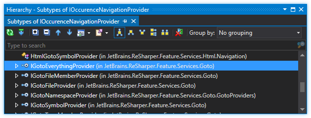

---
---

# Navigation

ReSharper navigation consists of two main parts:

* Context navigation ('Navigate From Here...')
* Global navigation ('Go To ...')

The navigation framework is fairly pluggable, so in most cases all you need to do is to simply provide your own components. You can implement the following features:

* Table of contents
{:toc}

## Context Navigation

Context navigation consists of two parts: the searching engine and the user-interaction provider. These two parts are divided into different entities in ReSharper Framework.

## Feature Providers

Feature providers represent features themselves. That is, there is just one provider per navigation feature regardless of the number of languages and environments where this feature is supposed to work.

Each context navigation provider implements either the `IContextSearchProvider` or the `INavigateFromHereProvider` interface. The `IContextSearchProvider` interface is defined as follows:

```csharp
public interface IContextSearchProvider
{
  [CanBeNull]
  Action GetSearchesExecution(IDataContext dataContext, INavigationExecutionHost host);
}
```

The action that the `GetSearchesExecution()` method returns is actually the execution of the navigation feature. When this method returns `null`, it implies that this feature is not available for this data context. The `INavigationExecutionHost` is a host object which can be used for performing certain UI activities, such as showing a drop-down box or the advanced search dialog.

The `INavigateFromHere` interface is fairly similar to `IContextSearchProvider` - it has just one method that returns navigation execution and additional data for presenting in the 'Navigate From Here' drop-down menu.

If you want your navigation items to appear in the 'Navigate From Here' menu, you have to implement the `INavigateFromHereProvider` interface.

## Binding to an action

You don't need to write any code in your action handler's methods, as all feature logic needs to be written inside navigation providers. All you need to bind your action to a navigation provider is to derive your custom action handler class from `ContextNavigationActionBase<TNavigateFromHereProvider>` (if you want your action to appear in the 'Navigate From Here' menu) or `ContextSearchActionBase<TContextSearchProvider>`.

Additionally, your provider should be decorated with the `ContextNavigationProvider` attribute.

> **NOTE** If you want your feature to appear only in 'Navigate From Here' menu, you don't even have to write an action - just implement `ContextNavigationProvider` that implements `INavigateFromHereProvider`.

If your navigation is not complicated, that's all you need to know about the context navigation framework.

## Example

Here is an example of simple navigation to the corresponding folder using Windows explorer.

```csharp
using System;
using System.Collections.Generic;
using System.Diagnostics;
using JetBrains.Annotations;
using JetBrains.Application.DataContext;
using JetBrains.ProjectModel;
using JetBrains.ReSharper.Feature.Services.ContextNavigation;
using JetBrains.Util;

using DataConstants = JetBrains.ProjectModel.DataContext.DataConstants;

namespace ReSharperPlugIn6
{
  [ActionHandler]
  public class SimpleNavigation : ContextNavigationActionBase<SimpleNavigationProvider>
  {
  }

  [ContextNavigationProvider]
  public class SimpleNavigationProvider : INavigateFromHereProvider
  {
    [CanBeNull]
    private static ProcessStartInfo GetProcessStartInfo([NotNull] FileSystemPath path)
    {
      return new ProcessStartInfo("explorer.exe",
        path.ExistsFile ? string.Format(@"/select,""{0}""", path) : string.Format(@"""{0}""", path.Directory));
    }

    [CanBeNull]
    private static FileSystemPath GetPathByContext([NotNull] IDataContext context)
    {
      var projectModelElement = context.GetData(DataConstants.PROJECT_MODEL_ELEMENT);

      var projectItem = projectModelElement as IProjectItem;
      if (projectItem == null)
        return null;

      if (!projectItem.Location.Directory.ExistsDirectory)
        return null;

      return projectItem.Location;
    }

    public IEnumerable<ContextNavigation> CreateWorkflow(IDataContext dataContext)
    {
      var path = GetPathByContext(dataContext);
      if (path != null)
      {
        ProcessStartInfo processStartInfo = GetProcessStartInfo(path);
        if (processStartInfo != null)
        {
          yield return new ContextNavigation( "&Windows Explorer", null, NavigationActionGroup.Other,
            () =>
            {
              try
              {
                using (Process.Start(processStartInfo)) { }
              }
              catch (Exception e)
              {
                MessageBox.ShowError(e.Message);
              }
            });
        }
      }
    }
  }
}
```

## Context Searches

If your navigation is complicated and works differently in differenent languages then you can use context searches to provide different search results for a specific language.

In this case, your provider needs to be derived from `ContextSearchesCollector<TContextSearch>` class and all you need is to implement the `Execute()` method.

```csharp
protected abstract void Execute(IDataContext dataContext, IEnumerable<TContextSearch> searches, INavigationExecutionHost host);
```

`IContextSearch` is an interface for providers decorated with the `FeaturePart` attribute and providing specific navigation execution. There are just two methods in this interface, indicating applicability and availability of said context search.

```csharp
public interface IContextSearch
{
  bool IsAvailable(IDataContext dataContext);
  bool IsApplicable(IDataContext dataContext);
}
```

The applicability method is more global and implies that this context search can work for this data context and will _override_ other components it is derived from.

Availability means that for a specific data context this context search is enabled and will be fired.

You can alter the behavior of existing ReSharper navigation features by providing your own context search components. Here is an example of a  context search that extends the 'Go To Implementation' search for XAML:

```csharp
[FeaturePart]
public class XamlImplementationContextSearch : ContextNavigation.ContextSearches.BaseSearches.ImplementationContextSearch
{
  protected override bool IsAvailable(IDataContext dataContext)
  {
    return true;
  }

  public override bool IsApplicable(IDataContext dataContext)
  {
    return ContextNavigationUtil.CheckDefaultApplicability<XamlLanguage>(dataContext);
  }

  protected override SearchImplementationsRequest CreateSearchRequest(IDataContext dataContext, IDeclaredElement declaredElement)
  {
    // Your custom logic here...
  }
}
```

## Global Navigation ('Go To ...')

_Global nagivation_ relates to functionality used in various global searches such as _Go To Type_ or _Go To Member_. Typically, these searches all function as a text-entry popup box that, when typed into, presents a list that can be further refined and then, upon selection, navigated to the declared element. In addition, lists can ‘morph’ so that a Go To Type search can suddenly become a Go To Symbol search with the press of one shortcut.

## Occurence Navigation Provider

In order to provide items for a particular global navigation mechanic, we need to implement an occurence navigation provider - a class that implements the `IOccurenceNavigationProvider` interface. The following image illustrates the hierarchy of this interface:



As you can see, the four interface members are self-descriprive, and are further implemented by concrete classes based on language. For example, `IGotoSymbolProvider` has concrete implementations for the CLR, CSS, HTML and JavaScript. This interface is also implemented by the `ClrGotoTypeMemberProvider`, which illustrates a kind of inheritance mechanic - this makes sense because Go To Symbol actually includes information from Go To Type.

The interface is fairly simple, and has only three members:

```csharp
public interface IOccurenceNavigationProvider : IApplicableGotoProvider
{
  IEnumerable<MatchingInfo> FindMatchingInfos(IdentifierMatcher matcher, INavigationScope scope,
                                              CheckForInterrupt checkCancelled, GotoContext gotoContext);
  IEnumerable<IOccurence> GetOccurencesByMatchingInfo(MatchingInfo navigationInfo, INavigationScope scope, GotoContext gotoContext);
}
```

The first method, `FindMatchingInfos()`, find matched items and returns a corresponding list of `MatchingInfo` objects. A `MatchingInfo` is simply a data class that describes the necessary info used to store a matching item - its identifier, a set of `IdentifierMatch` objects (corresponding to the matches, as there can be many) and some other service information.

The second method, `GetOccurencesByMatchingInfo`, returns a set of occurences given the matching information. An _occurence_ is essentially a pointer to the location where something was found. Since the definition of ‘something’ is quite vague, an occurence can be practically anything - a range in a text editor, a project reference, a while project or a file. For example, a project file is represented by a `ProjectItemOccurence`, which in turn references an `IProjectItem` it points to.

In addition, you are required to implement an interface member inherited from `IApplicableGotoProvider`:

```csharp
public interface IApplicableGotoProvider
{
  bool IsApplicable(INavigationScope scope, GotoContext gotoContext, IdentifierMatcher matcher);
}
```

The above method lets us determine if a particular provider should work in a given context. Providers can theoretically inherit from one another, and if you are overriding an existing provider, instead of working every single time (like a `SolutionComponent` would), it instead checks the `IsApplicable` result.

The API now provides you an interface called `IGotoEverythingProvider`, which happens to inherit these two interfaces and in addition specifies a sorting function declared as

```csharp
Func<int, int> ItemsPriorityFunc { get; }
```

This interface lets you calculate a priority of the displayed element, such that the lower the result gets returned, the higher is the priority of the element.

Now, to create a provider, simply implement the interface and decorate the class with `[ShellFeaturePart]`:

```csharp
[ShellFeaturePart]
class GoToYouTrackIssueProvider : IGotoEverythingProvider
{
  // ...
}
```

## Occurence Presenter

Having a set of occurences is great, but they’re useless until presented on-screen. And this is where occurence presenters come in. An occurence presenter is, basically, a class that knows how to present a particular occurence as a menu item. In addition to being decorated by an `OccurencePresenter` attribute, it is embodied by the `IOccurencePresenter` interface defined below:

```csharp
public interface IOccurencePresenter
{
  bool Present(IMenuItemDescriptor descriptor, IOccurence occurence,
    OccurencePresentationOptions occurencePresentationOptions);
  bool IsApplicable(IOccurence occurence);
}
```

First, there’s the `IsApplicable()` method. This method determines whether this occurence presenter is applicable for the particular type of occurence. These typically go hand-in-hand, for example:

```csharp
[OccurencePresenter(Priority=0.0)]
public class RangeOccurencePresenter : IOccurencePresenter
{
  public virtual bool IsApplicable(IOccurence occurence)
  {
    return occurence is RangeOccurence;
  }
  // other members omitted
}
```

Then there’s the `Present()` method, which is called when the `IOccurence` needs to be presented. The goal of this method is to make assignments to the `descriptor` parameter. The `IMenuItemDescriptor` interface is quite large, but the only property we need to concern ourselves with here is `Text` - this is a `RichText` definition that will be displayed as a menu item for this occurence.

Here's a sample implementation. Note that `descriptor.Style` _must_ be defined - otherwise, the item will be disabled.

```csharp
public bool Present(IMenuItemDescriptor descriptor, IOccurence occurence,
  OccurencePresentationOptions occurencePresentationOptions)
{
  var o = ((YouTrackIssueOccurence) occurence);
  descriptor.Text = o.IssueId;
  descriptor.Text.Append(" - ");
  descriptor.Text.Append(o.IssueDescription);
  descriptor.Style = MenuItemStyle.Enabled;
  return true;
}
```

## Occurence Kind Provider

When you open up, say, Find Usages, you’ll find that you have an ability to filter information. Some examples are read usages, write usages, attribute references, and so on. Each has its own special icon and an ability to filter it out if necessary.

The types of elements just mentioned are called _occurence kinds_. Many kinds of occurences can be found as static members of the `OccurenceKind` class, and new ones can be created. An occurence kind is simply an enum-like class, keeping only two bits of information: its name and whether it is primary or not. If the occurrence kind is set as primary, the Find Results window will always display this kind of occurrence regardless of what filter is set. Other occurrences are non-primary, i.e. they are only displayed when there are occurrences of this occurrence kind (e.g., unit tests).

Now, we can talk about occurence type providers. These are typically solution components (i.e., decorated with the `SolutionComponent` attributes) that also implement the `IOccurenceKindProvider` interface. This interface is defined as follows:

```csharp
public interface IOccurenceKindProvider
{
  ICollection<OccurenceKind> GetOccurenceKinds(IOccurence occurence);
  IEnumerable<OccurenceKind> GetAllPossibleOccurenceKinds();
}
```

The `GetAllPossibleOccurenceKinds()` method returns a list of all possible occurences that this provider can give in theory. For example, in C# we can yield interface qualifications, base method calls and invocations, whereas in VB we also have the `Handles` clause.

The `GetOccurenceKinds()` method returns a collection of occurence kinds (or you can return an `EmptyList<OccurenceKind>.InstanceList` if there aren’t any) that are applicable for a given occurence. Naturally, this typically assumes that you would try to cast the `IOccurence` to a concrete type (e.g., `ReferenceOccurence`) to investigate its contents and yield the occurence kinds accordingly.

## Occurence Section Provider

When search results are presented in a dialogue window, they are typically split into sections via horizintal lines. The component that provides information about the different types of section is a `FeaturePart` that implements the `IOccurenceSectionProvider` interface. The interface is defined as follows:

```csharp
public interface IOccurenceSectionProvider
{
  bool IsApplicable(OccurenceBrowserDescriptor descriptor);
  ICollection<TreeSection> GetTreeSections(OccurenceBrowserDescriptor descriptor);
  ICollection<GroupingSectionId> GetGroupSectionId(IOccurence occurence, OccurenceBrowserDescriptor descriptor);
}
```

Let’s go through the methods. Firstly, `IsApplicable()` checks whether this section provider is applicable given the type of the occurence browser we are working with. This is typically a simple `is` call, e.g.:

```csharp
public override bool IsApplicable(OccurenceBrowserDescriptor descriptor)
{
  return descriptor is GotoDeclaredElementsBrowserDescriptor;
}
```

The second method is `GetTreeSections()`, and it is this method that returns a set of `TreeSection` objects specific to this section provider. We’ll discuss the `TreeSection` structure in a moment, but let’s briefly discuss the third method first. `GetGroupSectionId` basically lets us determine the groups (there can be more than one) in which a particular `IOccurence` needs to appear. The default implementation as defined in the `OccurenceSectionProvider` class (you should inherit from this, rather than implementing the interface by hand) is to use a special method `GetSectionId()` to pick a known section given the type of the occurence:

```csharp
// in OccurenceSectionProvider
public virtual ICollection<GroupingSectionId> GetGroupSectionId(IOccurence occurence, OccurenceBrowserDescriptor descriptor)
{
  return new[] {occurence.OccurenceType.GetSectionId()};
}
```

## Tree Model

Now, let’s go back and talk about `TreeSection` definitions or, rather, about tree model, since the `TreeSection` is nothing more than a container class for a title and a `TreeModel` and it is this tree model that’s of interest to us.

A `TreeModel`, as you may have guessed, is simply a definition for the classical N-ary tree. The model itself has itself a collection of roots, i.e. a property `Roots` of type `IList<TreeModelNode>` as well as variousl mechanisms for insertion, removal and updating of `TreeModelNode` entities.

Each `TreeModelNode` in turn has a set of children, who are also `TreeModelNode` s themselves. Sorting is possible at both the `TreeModel` and `TreeModelNode` level. Note that the actual data storage inside the nodes is defined as an `object`, i.e. is untyped.

It helps to remember that both `TreeModel` and `TreeModelNode` are abstract classes, and that you are more likely to be working with their descendants, the most basic of which is `TreeSimpleModel`.

## Occurence

The menu items themselves are simply items which implement the `IOccurence` interface. This interface defines a rather large number of elements:

```csharp
public interface IOccurence
{
  TextRange TextRange { get; }
  ProjectModelElementEnvoy ProjectModelElementEnvoy { get; }
  DeclaredElementEnvoy<ITypeMember> TypeMember { get; }
  DeclaredElementEnvoy<ITypeElement> TypeElement { get; }
  DeclaredElementEnvoy<INamespace> Namespace { get; }
  OccurenceType OccurenceType { get; }
  bool IsValid { get; }
  object MergeKey { get; }
  IList<IOccurence> MergedItems { get; }
  OccurencePresentationOptions PresentationOptions { get; set; }
  bool Navigate(ISolution solution, PopupWindowContextSource windowContext, bool transferFocus, TabOptions tabOptions = TabOptions.Default);
  string DumpToString();
}
```

This interface is very feature-complete in terms of supporting, e.g., constructs which exist in code. In the case where you are providing ad hoc items not related to the PSI, you can provide the following defaults intead:

* `DumpToString()` - up to you, this is a debugging method.
* `TextRange` - just return a `new TextRange()`. You might want to consider making a single instance to return for each query.
* `MergeKey` - this yields a key which indicates whether or not several items should be merged. Thus, it makes sense to have this property yield a unique value for each item you don't intend to merge.
* `ProjectElementEnvoy`, `TypeMember`, `TypeElement`, `Namespace`, `MergedItems` - simply return `null`.
* `OccurenceType` - `OccurenceType.Occurence`.
* `IsValid` - `true`.
* `PresentationOption` - define it as a `get/set` property.

For examples of leveraging the various `IOccurence` members, take a look at some of the its built-in ReSharper implementors.

