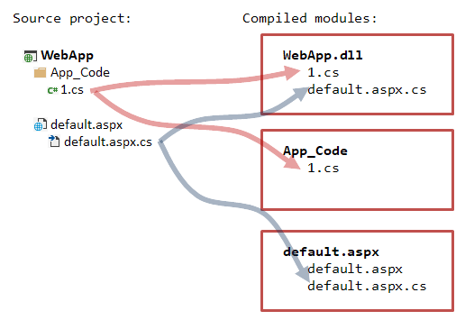
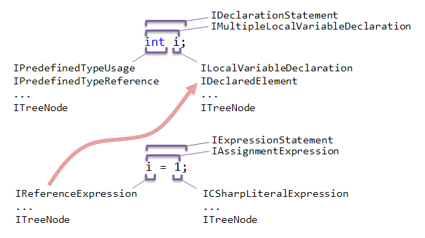

---
title: Navigate Code
--- 

ReSharper provides two types of navigation:
* **Context-dependent**: navigation target is somehow related to the element under the caret (**Navigate to Declaration**, etc).
See:
    * [Add a Navigation Action to the 'Navigate to' Menu](AddYourNavigationActionToNavigateToMenu.md)
* **Global**: any navigation target (**Go to Everything**, etc).

The navigation task can be divided into two steps:
* Find the navigation target (a particular code element). For example, in case of context navigation, you should first obtain the tree node under the current caret position and then find the related code element - your navigation target (e.g., declaration, particular usage, etc).
See:
    * [Get a Tree Node Under Caret](GetTreeNodeUnderCaret.md) 
    * [Get a Tree Node by Full CLR Name](GetTreeNodeByFullName.md) 
    * [Get a Tree Node by Reference](GetTreeNodeByReference.md)
    * [Use Manual Navigation](UseManualNavigation.md) 
* Move the caret to the target code element.
See:
    * [Navigate to a Particular Tree Node](NavigateToParticularTreeNode.md)

Before you'll take a look at SDK examples on how to perform navigation, **we strongly recommend** that you acquaint with ReSharper's project model and PSI fundamentals below in this section. Also it's worth to take a look at the example in [Get a Tree Node by Full CLR Name](GetTreeNodeByFullName.md) (this code actively operates with project model and PSI entities). 

## Project Model Basics
Project model is the API that allows working with entities that constitute a solution in Visual Studio: a solution itself, projects, folders, and files.

The main project model elements are:
* `ISolution`: solution representation created when a solution is loaded in Visual Studio. This is the root element of the project model that normally corresponds to the solution node in Visual Studio's **Solution Explorer**. `ISolution` provides many useful interface for working with other elements of the project model and even go down to PSI (e.g., see `ISolution.GetPsiServices()`).
* `IProject`: project and solution folder representation that provides interfaces for getting project files, project folders, and some specific staff, like, e.g., module-to-project references. `IProject` also has methods that allow you to go down to the PSI level, e.g., `GetPsiModules()` or `GetPsiSourceFileInProject()`. 
    There are several kinds of projects (`IProject.Kind` property): solution folder, website, regular project, misc files project.
* `IProjectFolder`: project folder representation.
* `IProjectFile`: representation of a file in a project. Provides various interfaces for working with other dependent project model elements, .e.g., `GetDependentFiles()` to get dependent project files.   

Other important elements:
* `IPsiModule`: a compilation unit. Normally, for a C# class library, `IPsiModule` correponds to a compiled *.dll* file (so, it's a rough equivalent of `IProject`).
* `IPsiSourceFile`: an abstraction that represents a file with source code that must be compiled, i.e, included in a compilation unit (`IPsiModule`). In a simple case, it's an equivalent of `IProjectFile`. `IPsiSourceFile` allows you to get [IFile](#psi-basics) that represents the PSI syntax tree of the file. So, it's somewhat your bridge down to the PSI level.

Why does ReSharper need these two entities if it already has `IProject` and `IProjectFile`? The problem is that one single project may be compiled into multiple modules as well as single `IProjectFile` may be represented with multiple source files. For better understanding consider the example below. Say, we have a simple web project called `WebApp`:



Here the single project is compiled into three modules. Each *.cs* file has two `IPsiSourceFile`(s) associated with it.

Therefore, if you are 100% sure that your project file is represented with just one source file, you can obtain an instance of `IPsiSourceFile` by calling the `IProjectFile.ToSourceFile()` method. It will return `FirstOrDefault()` element from the PSI source files collection. Otherwise, get all `IPsiSourceFile`(s) by calling `ToSourceFiles()`.

To obtain modules from `IProject`, use the `IProject.GetAllModules()` method.

## PSI Basics
PSI (program structure interface) is the API for working with code syntax tree (a tree representation of the source code). 
The main PSI elements are:
* `IFile`: an abstraction used to build the PSI syntax tree from [IPsiSourceFile](#project-model-basics). One source file may contain many `IFile`(s): one primary, many secondaries (build upon primary using the same PSI nodes), and injected PSIs (e.g., when there is a language injection, like a C# file containing a variable with JS code). To obtain `IFile` from a source file, use the `IPsiSourceFile.GetPsiFile()` method.
* `ITreeNode`: the most basic element of the syntax tree. Any element of the tree is a tree node (implements the `ITreeNode` interface). E.g., even a closing semicolon or a space between two words are tree nodes. 
* `IReference`: abstraction that attaches semantic model to tree nodes. E.g., the expression `i = 1` has a reference for `i` (a tree node that implements `IReferenceExpression`) which resolves to `IDeclaredElement` (see below), i.e., some property, field, or a local variable. You can use this reference in refactorings or context actions, to navigate to the referenced code element, and so on. Some nodes also have specific named references (depending on the node type). 
The ITreeNode interface provides the GetAllReferences method that returns all node references.
* `IDeclaredElement`: element of the semantic model. It is a meaningful code element that can be referenced by other code elements: a class declaration, a property, etc.
Note that there’s a difference between `IDeclaration` and `IDeclaredElement`. `IDeclaredElement` is an entity you can refer to, while `IDeclaration` is just a place in code where the declaration happens. For example, you have a partial class `Foo` that is implemented in two different parts:

    ```csharp
    public partial class Foo { /* ... */ }
    public partial class Foo { /* ... */ }
    ```

    Both top tree nodes of these declarations implement `IDeclaration -> IClassDeclaration`. But there's only one `IDeclaredElement` the declarations refer to via the `DeclaredElement` property - the class `Foo` declared in the global namespace. 
* Other PSI types: there are a lot of specific helper types for particular elements of the syntax tree. E.g., `IVariableDeclaration` and `ILocalVariableDeclaration` (for variable declarations), `IExpressionStatement` (for representing statements), and many more. Moreover, there are a lot of types that are specific to a particular language and, therefore, provide specific methods relevant only in the context of this language. E.g., `ICSharpDeclaration` or `IJavaScriptDynamicProperty`.

For better understanding, consider the example:



Note that even though this is not shown on the picture, the equals sign, semicolons, and even whitespaces are also special tree nodes of the syntax tree.
