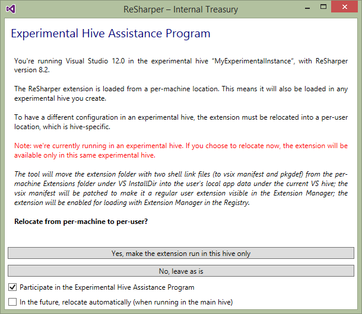

---
---

# Running ReSharper in Visual Studio Experimental Instance

> **WARNING** This topic relates to ReSharper 8, and has not been updated to ReSharper 9 or the ReSharper Platform.

Visual Studio's ["Experimental Instance"](http://msdn.microsoft.com/en-us/library/bb166560.aspx) feature is intended for developing and debugging Visual Studio extensions, and maintains a separate copy of the configuration needed to run Visual Studio. Each experimental instance can have an entirely different configuration, from theme and window layout to the extensions that are loaded.

> **NOTE** "Experimental instances" were previously known as "custom hives"

By default, ReSharper (and the other .net tools, dotCover, dotMemory, dotTrace, etc.) are installed as per-machine Visual Studio extensions. This means that they are available to all users on the machine, but also that they are loaded in all experimental instances.

The Platform layer that provides Visual Studio integration to ReSharper and the other .net tools, has support to move its registration from per-machine to per-user, and per-experimental instance. This allows for ReSharper (dotTrace, et al) to not be loaded in experimental instances, should the need arise.

> **NOTE** The information in this article relates to all .net tools that integrate with Visual Studio. From here on, they will be collectively described as "ReSharper", but the information equally applies to dotCover, dotMemory and dotTrace.

## Moving to a per-user install

ReSharper will handle moving the registration from per-machine to per-user automatically. When you run ReSharper in Internal mode, ReSharper will check and prompt to move to a per-user install (this process is deferred until initialisation is complete, and may take a couple of seconds). This is not the same as moving to an experimental instance, but will instead register ReSharper to run in the default Visual Studio instance. However, once moved, it will *only* run in the default instance, and not run in any experimental instances.

    devenv.exe /ReSharper.Internal

> **NOTE** The command line for the other products is the same, replacing `ReSharper.Internal` with `dotCover.Internal`, `dotMemory.Internal` or `dotTrace.Internal`.


If you click "Yes, make the extension run in this hive only", ReSharper will restart Visual Studio as admin, and move the registration files from the Visual Studio `Common7\IDE\Extensions` folder in `Program Files` to `%LOCALAPPDATA%\Microsoft\VisualStudio\X.X\Extensions`, where `X.X` is the version of Visual Studio (this is supported for Visual Studio 2010+). ReSharper will also update the `HKCU\Software\Microsoft\VisualStudio\X.X\ExtensionManager\EnabledExtensions` registry key to add the new location as an enabled extension.

> **WARNING** Moving the registration from per-machine to per-user means that only the current user will be able to run ReSharper. All other users will not see ReSharper in their Visual Studio. They will also need to go through this process, by first resetting ReSharper to a per-machine install, which won't affect the existing user's per-user registration. To reset the per-machine install, repair the install.

## Moving to an experimental instance

Moving to an experimental instance is the same process as moving to a per-user install, except you need to be running in the experimental instance. Once you've created an experimental instance, and assuming ReSharper is still installed per-machine, run Visual Studio in the experimental instance, and with the internal flag:

    devenv.exe /RootSuffix MyExpInstance /ReSharper.Internal

The same dialog will be displayed, and the per-machine registration moved to the experimental instance. ReSharper will now only load in the experimental instance.



If you have already moved the per-machine registration to be per-user, this technique won't work, as the per-user install only loads in the default Visual Studio instance. You need to repair the ReSharper install first, in order to restore the per-machine registration. This won't affect the per-user registration.

## Resetting the relocation dialog

If you uncheck the "Participate in the Experimental Hive Assistance Program" checkbox, ReSharper will no longer check for per-machine registration at startup, and will no longer display the dialog.

To reset this, you need to manually edit the `%APPDATA%\JetBrains\ReSharper\vAny\GlobalSettingsStorage.dotSettings` file (this is for advanced users, expect to get your hands dirty!). Search for the string `vsix` and remove any XML elements that contain it, particularly this one:

```xml
<s:Boolean x:Key="/Default/Housekeeping/JumpVsixFromMachineToPerUser/IsEnabled/@EntryValue">False</s:Boolean>
```

The next time you restart Visual Studio with ReSharper in internal mode, ReSharper will check, and display the dialog again.

## Side-by-side install of multiple versions

It is possible, although perhaps not very desirable, to have multiple versions of ReSharper or other .net tools installed side-by-side, by making use of experimental instances.

1. First, move the current install of ReSharper to an experimental instance, as detailed above (note that versions of ReSharper prior to 8.2 had a bug that didn't update the path to the extensions folder correctly in the registry, and 7.x requires to be manually run as admin)
1. When installing the new version of ReSharper, ensure that you select "Advanced" options in the installer, and uncheck the option to remove all previous versions
1. After installing, move the new version of ReSharper to a per-user install, by running with the internal flag. If the dialog doesn't popup, check the `GlobalSettingsStorage.dotSettings` file as detailed above.

